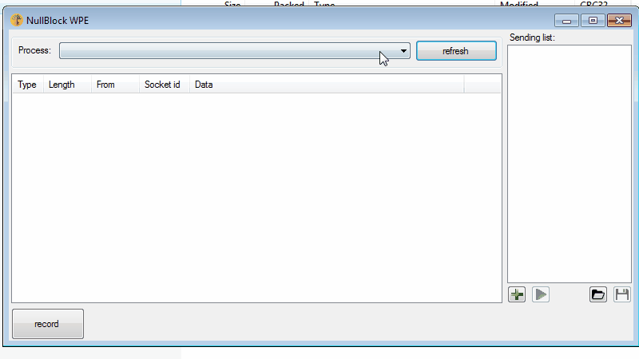

# WPE
Windows packet editor (WPE) for x64 and x86 applications. Ideally for MMORPG.

Allows to capture traffic, edit and send back to server.

Tested on windows 7 / 8.1 / 10.

you can download it here:
~~http://nullblock.tilda.ws/~~
in releases section
https://github.com/TheZeroSlave/WPE/releases/

## How to use it

In memory of BSGO.
