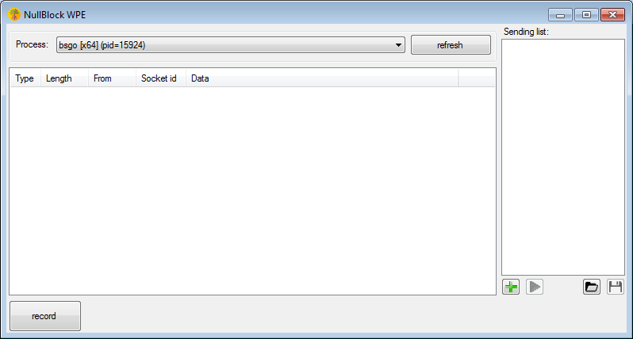
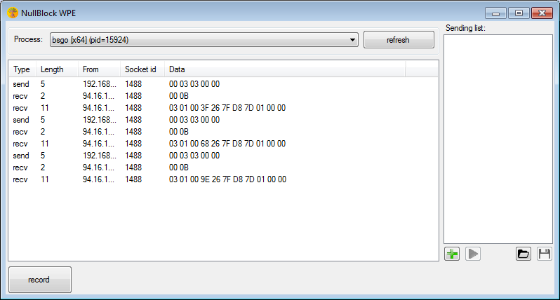
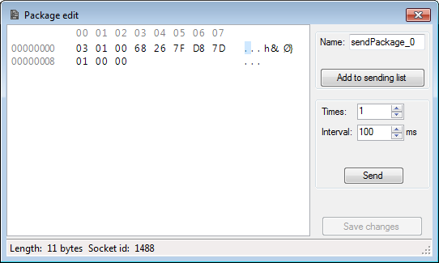

# WPE
Windows packet editor (WPE) for x64 and x86 applications. Ideally for MMORPG.

Allows to capture traffic, edit and send back to server.

Tested on windows 7 / 8.1 / 10.

you can download it here:
http://nullblock.tilda.ws/

## How to use it
Just choose the process you want to inject

Click 'record' when you're ready. You will be promted about UAC(admin required) - we need to patch selected process memory.

Wait a little, and get some packages.

Right click and you get some options(like edit, resend it to server or add to sending list).

In memory of BSGO.
